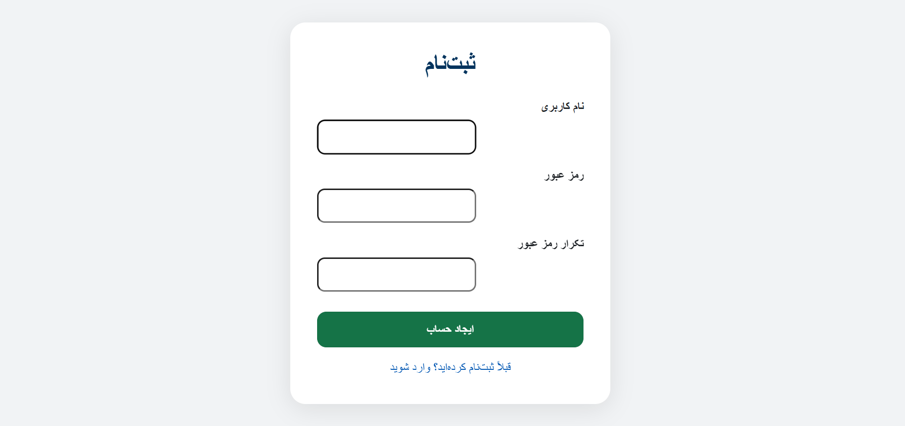
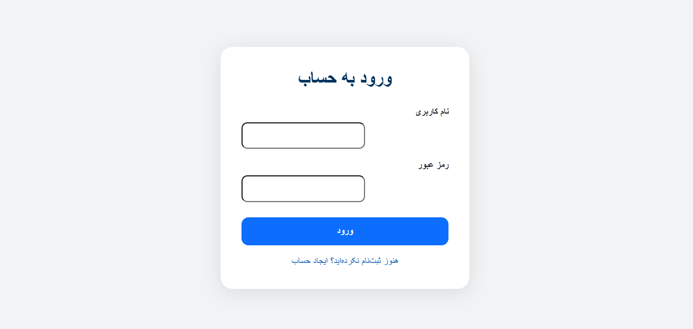
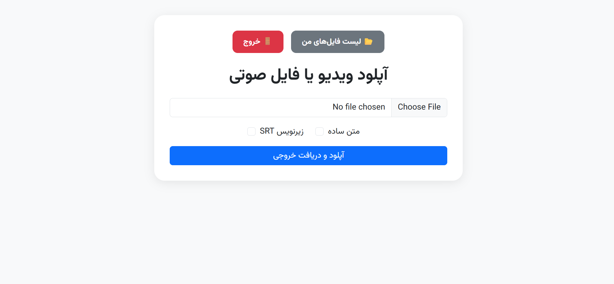

<div dir="rtl">


# پروژه فایل های صوتی و ویدیویی به متن `teksar` با جنگو




## 📋 توضیحات
این پروژه یک وبسایتی است که با کمک آن میتوان فایل ها صوتی و ویدیویی رو به متن و زیرنویس srt تبدیل میکند و هدف از آن این است که کاربران به راحتی بتوانند به راحتی فایل های صوتی و ویدیویی شان را به راحتی یک دکمه تبدیل به نوشته و زیرنویس کنند. 
## 🚀 ویژگی ها
`صفحات اولیه`
- <b>صفحه اصلی:</b>امکان اپلود کردن فایل صوتی و ویدیویی و انتخاب متن یا زیرنویس srt

`صفحات مربوط به ورود و ثبت نام`
- <b>سیستم ورود برای کاربران: </b>امکان ورود کاربران
- <b>سیستم ثبت نام برای کاربران: </b>امکان ثبت نام کاربران

`صفحات پنل کاربری`
- <b>لیست فایل های آپلود شده: </b>امکان دیدن فایل های اپلود شده و نمایش وضعیت آنها
- <b>جزئیات فایل : </b>امکان دانلود کردن فایل خروجی و دیدن خروجی به صورت پیش فرض

## 🎯 ابزار ها و فریم ورک ها
`django`
`django rest framework`
`faster_whisper`
`sqlite`

## 🛠️ نصب و راه اندازی
برای نصب و راه‌اندازی این پروژه، مراحل زیر را دنبال کنید:
1. **کلون کردن مخزن:**

```bash
git clone https://github.com/abolfazl-valiyan/teksar
cd teksar
```
2. **ایجاد محیط مجازی (اختیاری):**

```bash
python -m venv venv
source venv/bin/activate  # برای سیستم‌های Unix/Mac
venv\Scripts\activate  # برای ویندوز
```
3. **نصب وابستگی‌ها:**
   
```bash
pip install -r requirements.txt
```
4. ** دانلود مدل whisper:**

```bash
https://huggingface.co/ivrit-ai/whisper-large-v3-ct2/tree/main
```
در پروژه دایرکتوری models را ایجاد کنید و پوشه
whisper-large-v3-ct2 را به دایرکتوری models اضافه کنید 

5. **اجرای migrations:**

```bash
python manage.py migrate
```
6. **اجرای سرور:**

```bash
python manage.py runserver
```
7. **دسترسی به وب‌سایت:**

   در مرورگر خود به آدرس http://127.0.0.1:8000/ بروید.

## 💻 برنامه نویس
**ابوالفضل ولیان** - [لینک پروفایل گیت‌هاب](https://github.com/abolfazl-valiyan)

</div>